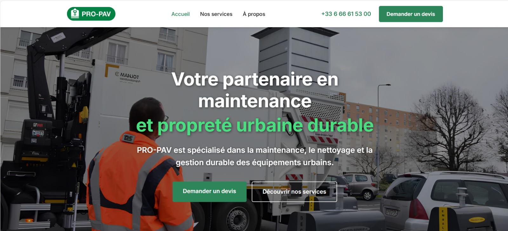
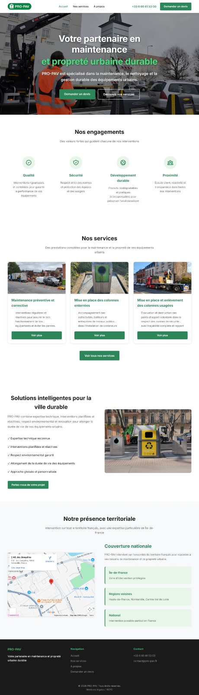

# 🌿 PRO-PAV — Website Showcase

### Professional • Responsive • Client-Focused

A modern corporate website created for **PRO-PAV**, a company specializing in urban equipment maintenance, cleaning and sustainable urban services.

 

---

## ✨ Project Overview

The goal of this project was to create a **clean, professional and responsive website** that presents PRO-PAV's activity, services and values while offering visitors a clear path to request a quote.

The interface was designed to provide a consistent experience across **desktop and mobile devices**.

---

## 🚀 Main Features

| Feature | Description |
|---|---|
| 🖥️ Modern landing page | Clear and professional presentation of the company |
| 📱 Responsive design | Optimized for desktop, tablet and mobile |
| 🧰 Services showcase | Structured presentation of PRO-PAV services |
| 🏢 Company presentation | Dedicated content about the business and its positioning |
| 📝 Quote request | Simple interface for requesting a quotation |
| 🧭 Responsive navigation | Mobile-friendly navigation experience |
| 📍 Territorial presence | Presentation of the company's intervention area |
| 🎯 UX-focused layout | Clear hierarchy and user-friendly navigation |

---

## 🛠️ Technologies Used

| Frontend | Backend | Design |
|---|---|---|
| HTML5 | PHP | Responsive Design |
| CSS3 | Form Processing | Mobile-First Adaptation |
| JavaScript | Server-side Validation | UX / UI Integration |

> 🔒 **Client confidentiality:** the source code is intentionally kept private.

---

# 🖼️ Website Preview

## 🖥️ Desktop — Hero Section

 

## 🌐 Full Website

 

---

# 🎬 Video Demonstration

Below is a short walkthrough showing the website, responsive layout and main sections.

https://github.com/user-attachments/assets/75dc3ab5-83ee-43cf-8f73-ede7d4c55a1e

<!-- IMPORTANT:
Keep the GitHub video attachment line that GitHub generated for you directly below this comment.
Example:
https://github.com/user-attachments/assets/xxxxxxxx-xxxx-xxxx-xxxx-xxxxxxxxxxxx
-->

---

# 👨‍💻 My Contribution

I worked on the design and development of the website, including:

- 🎨 User interface implementation
- 📱 Responsive desktop and mobile adaptation
- 🧱 Website structure and page organization
- 🧭 Navigation and user experience
- 🧰 Services presentation
- 📝 Quote request interface
- ⚙️ PHP form processing and validation
- ✨ Front-end integration and visual consistency

---

# 🎯 Project Goals

This project focused on three priorities:

**01 — Professional Image**  
Create a visual identity that reflects a reliable and professional urban maintenance company.

**02 — Clear Communication**  
Make services, expertise and company information easy to understand.

**03 — Responsive Experience**  
Ensure comfortable navigation across desktop and mobile devices.

---

## 🔐 Confidentiality

This repository is intended **exclusively as a portfolio showcase**.

The following elements are intentionally not published:

- Source code
- Server configuration
- Credentials
- Internal client data
- Sensitive implementation details

This allows the project to be presented while respecting **client confidentiality and intellectual property**.

---

### ⭐ Portfolio Project

**PRO-PAV Website Showcase**

Built with a focus on **professional presentation, responsiveness and user experience**.

